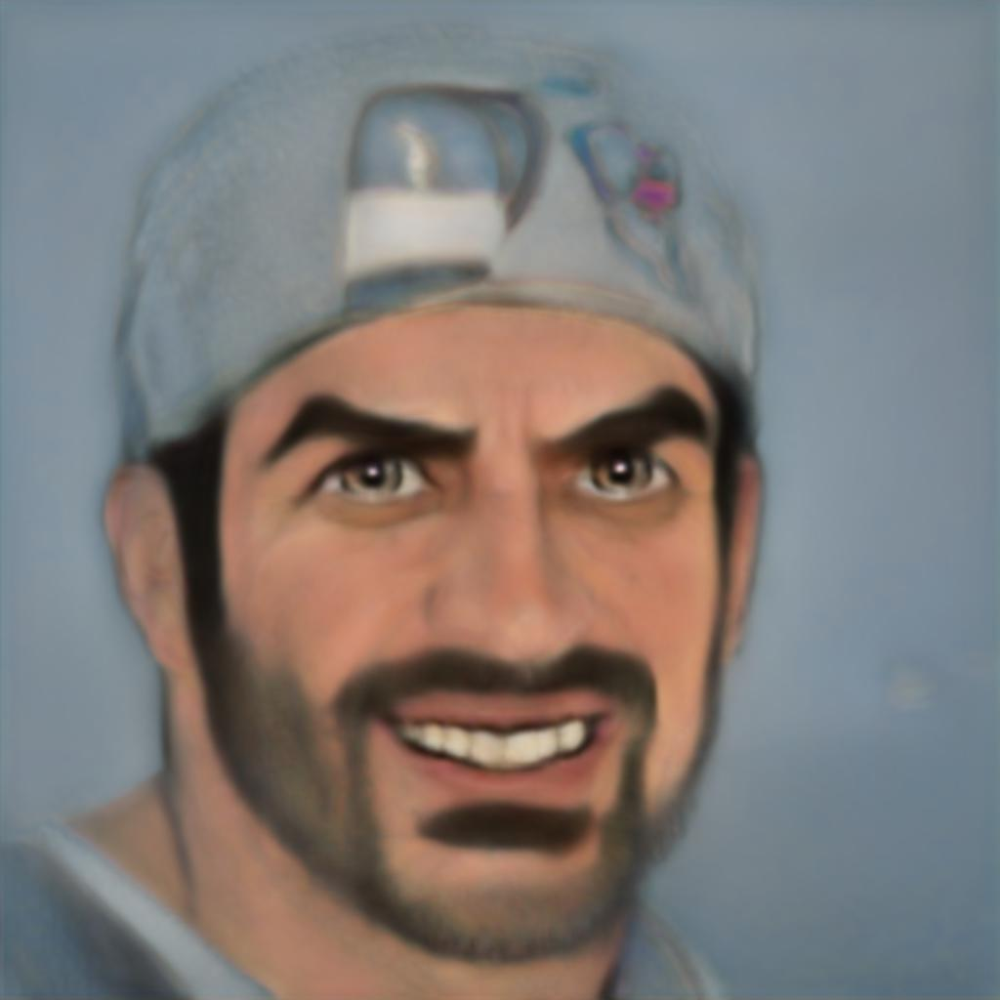
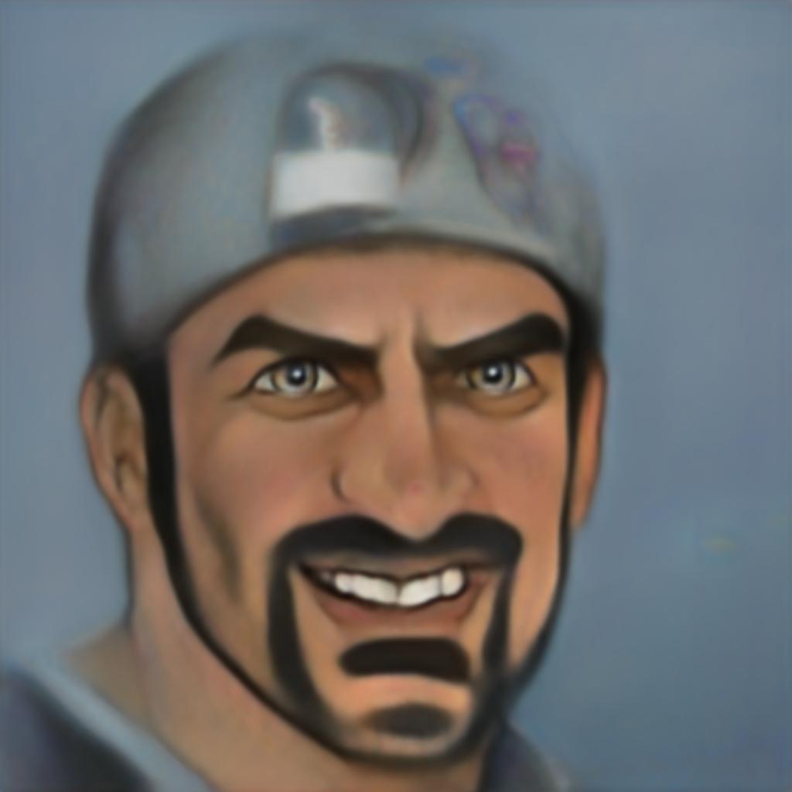
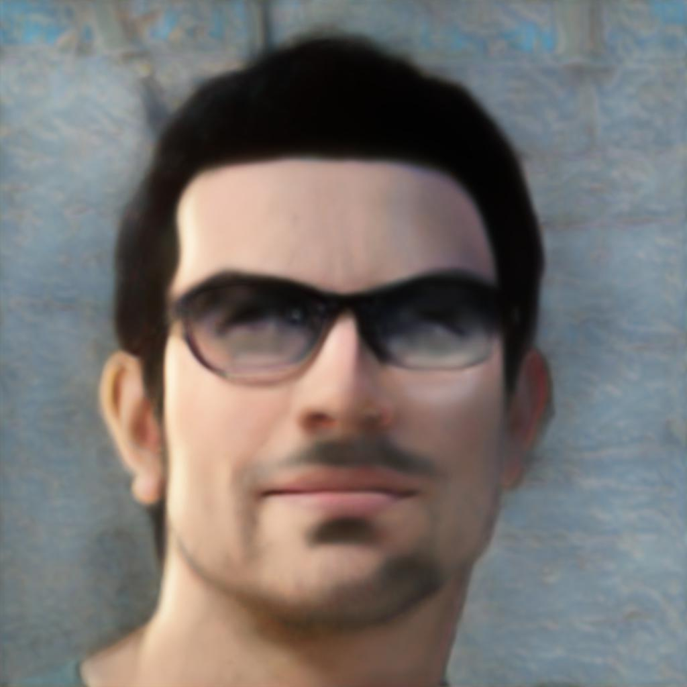

<p>
<h1 align="center">U<sup>2</sup>-Net: U Square Net</h1><h2 align="center">Modified for paired image training of style transfer</h2>

    
</p>

This is an unofficial repo making use of the [code which was made available](https://github.com/xuebinqin/U-2-Net) by the original author team of **U<sup>2</sup>-Net (U square net)** published in Pattern Recognition 2020:

## [U<sup>2</sup>-Net: Going Deeper with Nested U-Structure for Salient Object Detection](https://arxiv.org/pdf/2005.09007.pdf)
[Xuebin Qin](https://webdocs.cs.ualberta.ca/~xuebin/), [Zichen Zhang](https://webdocs.cs.ualberta.ca/~zichen2/), [Chenyang Huang](https://chenyangh.com/), [Masood Dehghan](https://sites.google.com/view/masooddehghan), [Osmar R. Zaiane](http://webdocs.cs.ualberta.ca/~zaiane/) and [Martin Jagersand](https://webdocs.cs.ualberta.ca/~jag/)

## Before you clone this repo

Make sure you have [git lfs ](https://git-lfs.github.com/) installed and [configured](https://stackoverflow.com/a/56284009/1495606), so the actual model files will be downloaded rather than just a reference pointer to their location

## Inference

See [u2net_test.py](./u2net_test.py)

<table>
<tr>
<td> <p> input</p></td><td> <p> u2netp (4.9 MB) </p></td><td> <p> u2net (176.5 MB) </p></td>
</tr>
  <tr>
    <td> </td>
<td> </td>
<td> </td>
   </tr> 
   <tr>
    <td> </td>
<td> </td>
<td> </td>
   </tr> 
 </table>

## Training

See [u2net_train.py](./u2net_train.py)

## Pre-Trained models

Available [here](./saved_models/)

## Citation data of the original Repo
```
@InProceedings{Qin_2020_PR,
title = {U2-Net: Going Deeper with Nested U-Structure for Salient Object Detection},
author = {Qin, Xuebin and Zhang, Zichen and Huang, Chenyang and Dehghan, Masood and Zaiane, Osmar and Jagersand, Martin},
journal = {Pattern Recognition},
volume = {106},
pages = {107404},
year = {2020}
}
```
